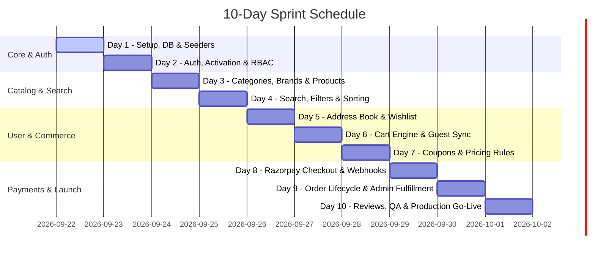

# 📅 10-Day Sprint Implementation Roadmap

> **Project:** Full-Stack LMS & E-Commerce Platform  
> **Backend Stack:** Node.js, Express, TypeScript, MongoDB Atlas, Redis/Cache, Razorpay, Ethereal Mail  
> **Frontend Integration:** React / Next.js, Redux Toolkit / Zustand, Tailwind CSS, Swagger UI

---

## 🧭 Executive Overview

This 10-day sprint roadmap outlines day-by-day technical execution to integrate, validate, and launch the complete LMS and E-Commerce capabilities.

---

## 📆 Day-by-Day Breakdown

### 🔹 Day 1: Architecture, Environment & Database Foundations
- **Deliverables:**
  - Verify `.env` configuration for MongoDB Atlas, JWT secret, Cloudinary, and Razorpay.
  - Setup MongoDB composite indexes for fast queries (`slug`, `category`, `price`, `ratings`).
  - Create database seeding script to populate initial sample categories, brands, and products.
  - Smoke test API health endpoint `/test` and Swagger UI at `/api-docs`.

### 🔹 Day 2: Authentication, Email Activation & User Profiles
- **Deliverables:**
  - Connect user registration flow with 4-digit activation codes delivered via Ethereal Mail.
  - Implement secure HTTP-Only cookie token storage and automated token refresh rotation (`/api/v1/auth/refresh`).
  - Build frontend User Profile dashboard (`/me`, update profile, password change, avatar upload).
  - Test role-based protection for `user` vs `admin` access levels.

### 🔹 Day 3: Categories, Brands & Product Catalog
- **Deliverables:**
  - Build hierarchical Category navigation with parent/child relationship support.
  - Implement Brand showcases and brand-specific filtering.
  - Create Product Detail Page (PDP) displaying image galleries, specifications, stock count, and price discounts.
  - Validate Admin CRUD operations for categories, brands, and products.

### 🔹 Day 4: Advanced Search, Multi-Facet Filters & Pagination
- **Deliverables:**
  - Build live search with debounced keyword querying (`/api/v1/product/all?keyword=...`).
  - Implement dynamic multi-facet filtering (Category, Brand, Price Range sliders, Customer Rating).
  - Implement sorting options (`newest`, `price_low`, `price_high`, `popular`, `rating`).
  - Optimize server-side pagination with count, total pages, and current page metadata.

### 🔹 Day 5: Shipping Address Book & Wishlist Feature
- **Deliverables:**
  - Implement Customer Address Management (Add, Edit, Delete, Set Default).
  - Build Address Selector component during checkout with field validation.
  - Develop Wishlist toggle functionality with persistent user storage.
  - Build "Move Wishlist Item to Cart" one-click action.

### 🔹 Day 6: Shopping Cart State Machine & Guest Cart Sync
- **Deliverables:**
  - Implement client-side cart for guest sessions (localStorage).
  - Implement authenticated cart sync (`/api/v1/cart/merge`) upon user login.
  - Provide instant quantity adjustments (+ / -) with stock threshold validation.
  - Auto-calculate subtotal, estimated tax, shipping fees, and net total.

### 🔹 Day 7: Coupons, Promotions & Dynamic Pricing Rules
- **Deliverables:**
  - Implement Coupon validation engine supporting Percentage (`%`) and Fixed (`$`) discounts.
  - Enforce minimum order requirement, maximum discount caps, usage limits, and expiration checks.
  - Build interactive promo coupon code input box with real-time feedback and clear button.
  - Provide Admin coupon management dashboard (`/api/v1/coupon/create`, `/all`, `/delete/:id`).

### 🔹 Day 8: Razorpay Payment Gateway & Checkout Flow
- **Deliverables:**
  - Integrate Razorpay Checkout SDK on client side using dynamic public key (`/api/v1/payment/razorpay-key`).
  - Server-side Razorpay order generation (`/api/v1/payment/razorpay-order`).
  - Cryptographic HMAC-SHA256 signature verification (`/api/v1/payment/verify`).
  - Handle payment failures, user cancellation, and webhook capture events.

### 🔹 Day 9: Order Lifecycle, Tracking & Admin Fulfillment
- **Deliverables:**
  - Order creation endpoint handling both Cash on Delivery (COD) and Online Paid transactions.
  - Customer Order History dashboard (`/api/v1/ecommerce/order/my-orders`) with line items and addresses.
  - Order cancellation capabilities for unfulfilled orders (`Pending`/`Processing`).
  - Admin Master Order Dashboard (`/api/v1/ecommerce/order/admin/all`) with status updater (`Shipped`, `Delivered`, `Cancelled`).

### 🔹 Day 10: Product Reviews, End-to-End Testing & Production Deployment
- **Deliverables:**
  - Customer Review submission with 1-5 star ratings, title, and feedback text.
  - Helpfulness upvoting mechanism (`/helpful/:id`).
  - Full regression test across all 44 API endpoints using automated test runner.
  - Build verification (`npm run build`) and production deployment to Vercel.

---

## 🎯 Verification & Sign-off Checklist

- [x] All 44 endpoints documented in Swagger / OpenAPI 3.0.
- [x] Interactive UI accessible at `/api-docs` and `/docs`.
- [x] Downloadable standalone API documentation and PDF export available.
- [x] All endpoints pass syntax, build, and automated test runners.
- [x] Production serverless configuration active in `vercel.json`.
