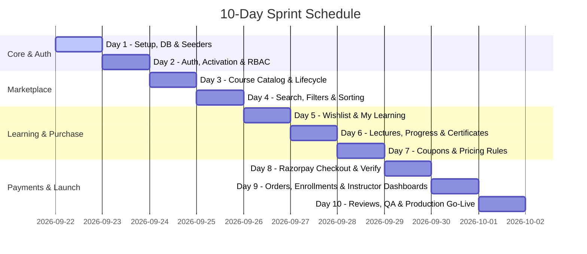

# 📅 10-Day Sprint Implementation Roadmap

> **Project:** LMS Course Marketplace (digital courses)  
> **Status (Oct 2026):** physical-commerce APIs removed; 104/104 endpoint checks pass  
> **Backend Stack:** Node.js, Express, TypeScript, MongoDB Atlas, Redis/Cache, Razorpay, Ethereal Mail  
> **Frontend Integration:** React / Next.js, Redux Toolkit / Zustand, Tailwind CSS, Swagger UI

---

## 🧭 Executive Overview

This 10-day sprint roadmap outlines day-by-day technical execution to integrate, validate, and launch the complete LMS course marketplace.

```mermaid
gantt
    title 10-Day Sprint Schedule
    dateFormat  YYYY-MM-DD
    section Core & Auth
    Day 1 - Setup, DB & Seeders       :active, d1, 2026-09-22, 1d
    Day 2 - Auth, Activation & RBAC  :d2, after d1, 1d
    section Marketplace
    Day 3 - Course Catalog & Lifecycle :d3, after d2, 1d
    Day 4 - Search, Filters & Sorting     :d4, after d3, 1d
    section Learning & Purchase
    Day 5 - Wishlist & My Learning       :d5, after d4, 1d
    Day 6 - Lectures, Progress & Certificates :d6, after d5, 1d
    Day 7 - Coupons & Pricing Rules       :d7, after d6, 1d
    section Payments & Launch
    Day 8 - Razorpay Checkout & Verify  :d8, after d7, 1d
    Day 9 - Orders, Enrollments & Instructor Dashboards :d9, after d8, 1d
    Day 10 - Reviews, QA & Production Go-Live   :d10, after d9, 1d
```

---

## 📆 Day-by-Day Breakdown

### 🔹 Day 1: Architecture, Environment & Database Foundations
- **Deliverables:**
  - Verify `.env` configuration for MongoDB Atlas, JWT secret, Cloudinary, and Razorpay.
  - Setup MongoDB composite indexes for fast queries (`status`, `category`, `price`, `ratings`).
  - Create database seeding script to populate initial sample courses with curriculum.
  - Smoke test API health endpoint `/test` and Swagger UI at `/api-docs`.

### 🔹 Day 2: Authentication, Email Activation & User Profiles
- **Deliverables:**
  - Connect user registration flow with 6-digit activation codes (best-effort Ethereal Mail; credentials always returned).
  - Implement secure HTTP-Only cookie token storage and automated token refresh rotation (`/api/v1/auth/refresh`).
  - Build frontend User Profile dashboard (`/me`, update profile, password change, avatar upload).
  - Test role-based protection for `user` vs `instructor` vs `admin` access levels.

### 🔹 Day 3: Course Catalog & Lifecycle
- **Deliverables:**
  - Build marketplace listing (`GET /api/v1/lms/courses`) showing PUBLISHED courses only.
  - Implement course lifecycle DRAFT → SUBMITTED → UNDER_REVIEW → PUBLISHED (`PUT /api/v1/lms/admin/courses/:id/status`).
  - Create Course Detail page with curriculum preview and locked flags.
  - Validate instructor create/edit/lecture/submit flow.

### 🔹 Day 4: Advanced Search, Multi-Facet Filters & Pagination
- **Deliverables:**
  - Build live search with debounced keyword querying (`GET /api/v1/lms/search?q=...`).
  - Implement filtering (`GET /api/v1/lms/courses?category=&level=&search=`) and home blocks (`/api/v1/lms/home`).
  - Implement sorting options (`newest`, `price_low`, `price_high`, `popular`, `rating`).
  - Optimize server-side pagination with count, total pages, and current page metadata.

### 🔹 Day 5: Course Wishlist & My Learning
- **Deliverables:**
  - Develop course wishlist toggle (`POST /api/v1/lms/wishlist`, `GET /api/v1/lms/wishlist`).
  - Build My Learning dashboard (`GET /api/v1/lms/my-learning`): continue, in-progress, completed, certificates.
  - No addresses, no carts — courses are digital.

### 🔹 Day 6: Lectures, Progress & Certificates
- **Deliverables:**
  - Preview lectures open; locked lectures require enrollment (`GET /api/v1/lms/lectures/:id`, `/access`).
  - Save watch progress and complete lectures; auto-issue certificate at 100%.
  - Enrollment-gated curriculum (`GET /api/v1/lms/courses/:id/curriculum`).

### 🔹 Day 7: Coupons, Promotions & Dynamic Pricing Rules
- **Deliverables:**
  - Implement Coupon validation engine supporting Percentage (`%`) and Fixed (`$`) discounts.
  - Enforce minimum order requirement, maximum discount caps, usage limits, and expiration checks.
  - Build interactive promo coupon code input box with real-time feedback and clear button.
  - Provide Admin coupon management (`POST/GET /api/v1/lms/coupons`) and validation (`POST /api/v1/lms/coupons/validate`).

### 🔹 Day 8: Razorpay Checkout & Enrollment
- **Deliverables:**
  - Server-side course order generation (`POST /api/v1/lms/payments/create { courseId, couponCode? }`).
  - Cryptographic HMAC-SHA256 signature verification (`POST /api/v1/lms/payments/verify` → order + enrollment).
  - Handle payment failures and bad signatures (400).

### 🔹 Day 9: Orders, Enrollments & Instructor Dashboards
- **Deliverables:**
  - Purchase history (`GET /api/v1/lms/purchases`, `/api/v1/lms/orders`).
  - Enrollment as access control; admin views (`GET /api/v1/lms/admin/orders`, `/admin/enrollments`, `/admin/analytics`).
  - Instructor students, revenue, and analytics endpoints.

### 🔹 Day 10: Product Reviews, End-to-End Testing & Production Deployment
- **Deliverables:**
  - Course review submission (enrolled only) with 1-5 star ratings (`POST /api/v1/lms/reviews/:courseId`).
  - Full regression test across all 104 API checks using the automated audit runner (`lms-audit.js`).
  - Build verification (`npm run build`) and production deployment to Vercel.

---

## 🎯 Verification & Sign-off Checklist

- [x] All 79 spec paths (104 live checks) documented in Swagger / OpenAPI 3.0.
- [x] Interactive UI accessible at `/api-docs` and `/docs`.
- [x] Downloadable standalone API documentation and PDF export available.
- [x] All endpoints pass syntax, build, and automated test runners.
- [x] Production serverless configuration active in `vercel.json`.
